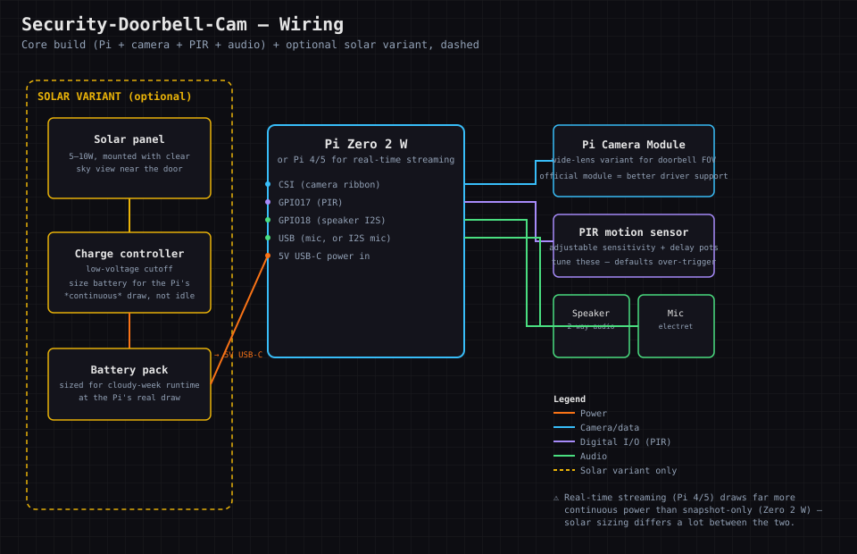
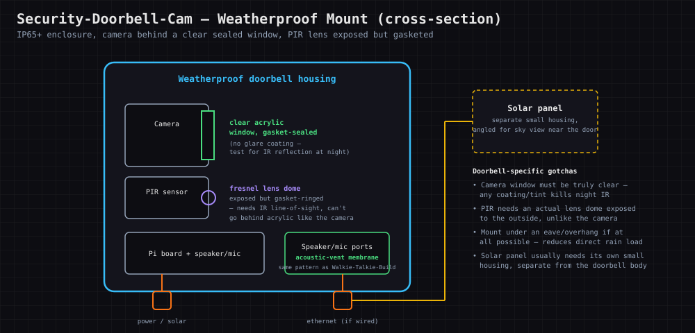

# Security-Doorbell-Cam

### A Pi-based camera + motion sensor + notifications — build the thing a commercial smart doorbell is, and keep the footage on your own hardware instead of a vendor's cloud.

  

[📖 Lesson Plan](docs/LESSON_PLAN.md)

<!-- SCREENSHOT PLACEHOLDER: docs/screenshots/overview.png -->

> ⬜ **Scaffold pending.** Directory created to portfolio standard; full content to be built. Real-hardware build with an emulation/planning-first path. Part of **Chain K — Hardware & Systems Foundations**.

## Why This Was Built

A commercial smart doorbell is a camera, a PIR sensor, a speaker/mic, and a subscription that ships your
footage to someone else's server. Building the same thing means the footage stays on hardware you control,
and it puts a real face on "computer vision" and "push notifications" — not as abstractions, but as a
motion event that has to become a phone alert in under a couple of seconds to be useful at all.

## Hardware Buying Guide (What to look for & red flags)

**Parts list:** a Raspberry Pi (Zero 2 W is enough for motion detection + snapshots; a Pi 4/5 if you want
real-time video streaming too), an official Pi Camera Module, a PIR motion sensor, a small speaker +
electret mic if adding two-way audio, and a weatherproof enclosure if mounting outside (see
**Walkie-Talkie-Build**'s waterproofing section — the same pattern applies).

**What to look for:** the official Camera Module has far better driver support than generic clones; a
wide field-of-view lens version matters more for a doorbell (close, wide angle) than the standard one.

**Red flags:** generic "spy camera" modules with no documented interface to the Pi, and PIR sensors with
no adjustable sensitivity/delay (you'll want to tune both — default settings trigger constantly on
passing cars or blowing leaves).

**Common failure points:** PIR false-triggers from sunlight/heat sources or moving foliage (tune
sensitivity and add a debounce delay in software), notification latency if the detection pipeline is too
heavy for a Zero-class board, and — if mounted outside — the same condensation/sealing issues every
outdoor build in this chain has to solve.

## Wiring Diagrams

**Core build, with the solar variant called out.** Pi reads the camera over CSI, the PIR sensor on a GPIO
pin, and drives speaker/mic for two-way audio; the solar branch (dashed, yellow) replaces wall power —
panel → charge controller (low-voltage cutoff) → battery → Pi's 5V USB-C in. Real-time streaming (Pi 4/5)
draws meaningfully more continuous power than snapshot-only (Zero 2 W), which changes how the solar side
needs to be sized:

**Weatherproof mount, cross-section.** The camera sits behind a sealed clear window (never tinted — kills
night IR), but the PIR sensor's fresnel lens has to stay physically exposed (just gasket-ringed) since it
needs direct IR line-of-sight — it can't go behind acrylic the way the camera can:

## Parts & Pricing

Pulled from the chain-wide [Hardware Shopping List](../HARDWARE_SHOPPING_LIST.md#security-doorbell-cam) —
check there for current links; prices drift. **Budget/Mid/Luxury are the same tiers the shopping list calls
Budget/Mid/Premium.**

| Item | Budget | Mid | Luxury |
|---|---|---|---|
| Board | Pi Zero 2 W, ~$15–35 (snapshots/motion only) | Same | Pi 4, ~$55–75 — real-time video streaming |
| Camera | Generic Pi-compatible clone (~$10) | [Official Camera Module 3, ~$25](https://www.raspberrypi.com/products/camera-module-3/) — real driver support | [Camera Module 3 Wide, ~$35](https://www.amazon.com/Raspberry-Pi-Camera-Module-Wide/dp/B0BRY757NX) — 120° FOV, better doorbell framing |
| Motion sensor | Basic PIR module (~$8–10) | Same, adjustable sensitivity/delay pots | — (already the right pick at every tier) |
| **Solar power** *(optional variant)* | Generic 5–10W panel + basic controller (~$25–30) | Panel + controller **with low-voltage cutoff** (~$35–40) | Adafruit/Victron-class controller (~$20–40) + battery sized for Pi 4 streaming draw |
| **Weatherproof mount** *(optional variant)* | Generic project box + shared cable gland kit + clear acrylic window | [TICONN IP67 junction box, ~$25](https://www.amazon.com/TICONN-Waterproof-Electrical-Junction-Enclosure/dp/B0B87THLGC) | [Adafruit flanged weatherproof enclosure, ~$15–20](https://www.adafruit.com/product/3931) — glands pre-installed |

Running total, core build: **~$33–55 budget (Zero 2 W) → up to ~$110–135 luxury (Pi 4 + wide camera)**. Add
the solar and weatherproof rows for the full outdoor-mounted version — genuinely the more common way this
project actually gets built, since a doorbell cam mounted indoors isn't watching a door.

## Why This Matters (Industry Application)

This is a real, complete edge-computing pipeline in miniature: sensor trigger → local inference/decision →
notification — the same shape as industrial and retail computer-vision deployments, just small enough to
build and fully understand yourself.

## Topics Covered

| Area | What this project covers |
|------|--------------------------|
| Camera modules | Interfacing and capturing from the Pi Camera |
| Motion detection | PIR sensors and tuning false-trigger rate |
| Notifications | Getting an event to your phone quickly |
| Audio | Two-way speaker/mic for a real intercom feature |
| Storage | Local footage retention instead of a cloud subscription |
| Weatherproofing | Mounting a camera/electronics outside safely |

## How This Connects

Chain K (Hardware & Systems Foundations). Builds on **Raspberry-Pi-Tinkering**'s GPIO/camera basics;
reuses audio skills from **Cyberdeck-Cellular-And-Media** and waterproofing from **Walkie-Talkie-Build**.

---
Dual licensed — [GPL v3](LICENSE-GPL) and [AGPL v3](LICENSE-AGPL).
